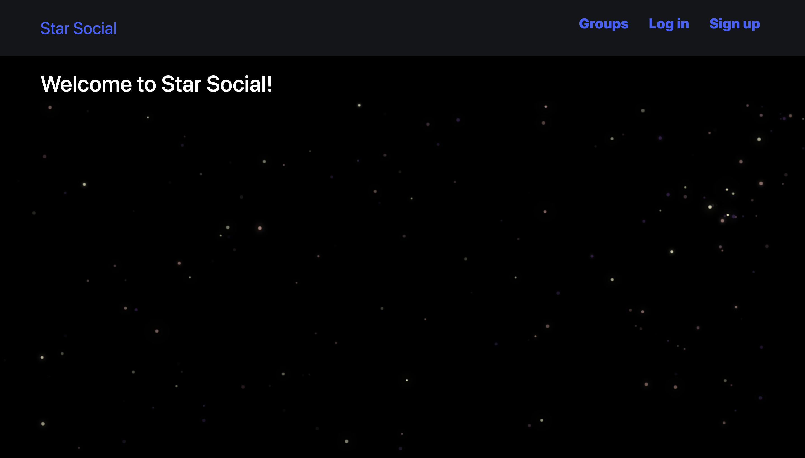
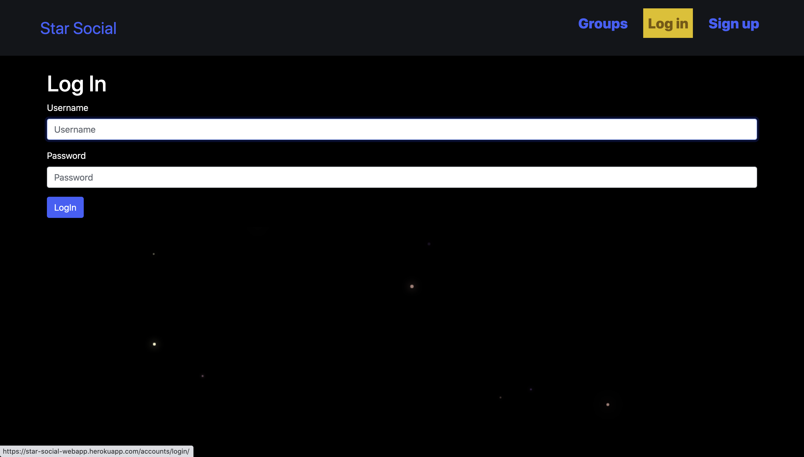
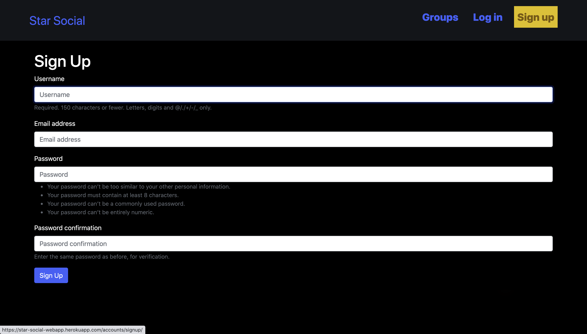
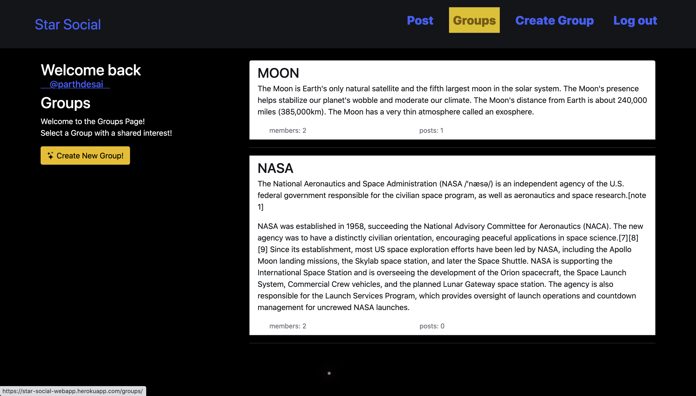
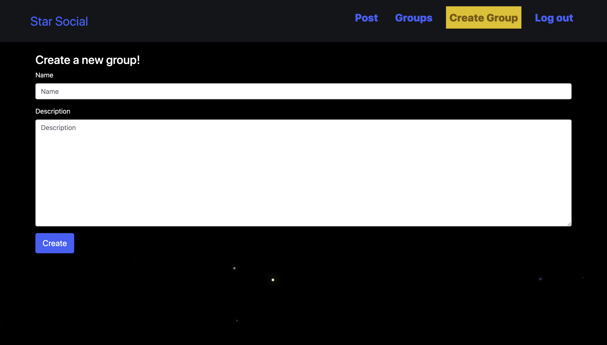
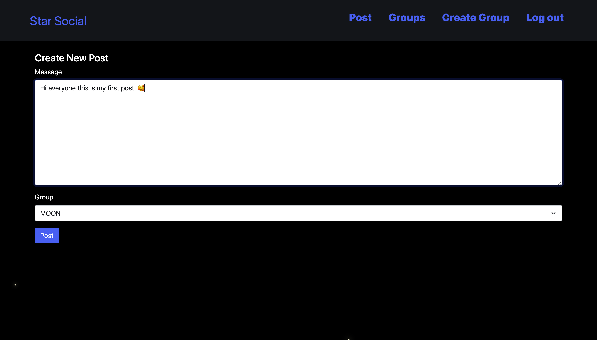
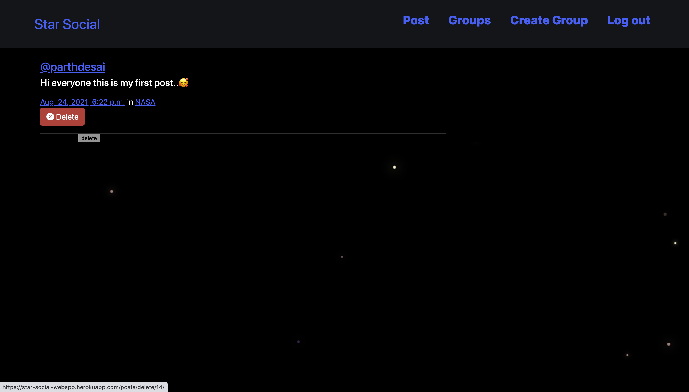
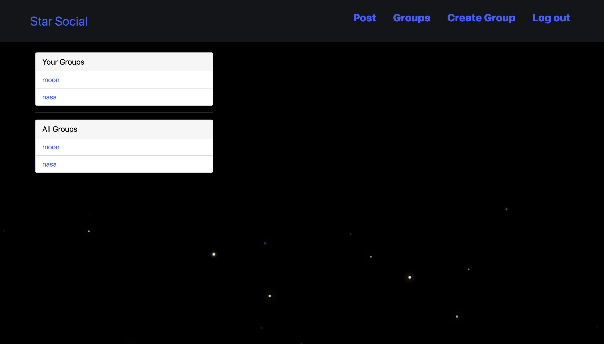
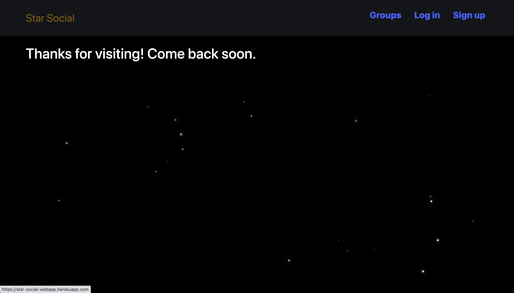

#  🌟 Star Social

Fullstack Django social media web app implemented using Django 3 with MVT (Model-View-Template) architecture and CBVs (Class-Based-Views). The app is a community for fans of outer space. Users can create groups on various topics (eg. SpaceX, NASA, Pluto, etc.). Users can then create posts in the groups; they can also leave and join other groups. New users are able to signup, and can link user profiles with the @ symbol.

App deployed on heroku (PAAS)  
link: https://star-social-webapp.herokuapp.com/

## Screenshots

 

 

 

 

 

 

 

 

